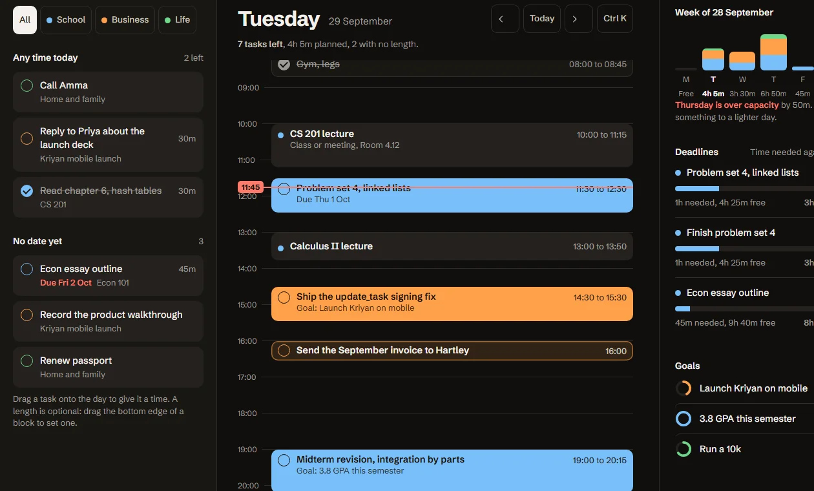

# Kriyan

Kriyan is an open-source planner that makes organising and planning your life easy. Plan with the AI you already use to get more done.



[Open Kriyan](https://app.kriyan.app/app) | [Try the public demo](https://kriyan.app/demo) | [Read the docs](docs/site/index.md)

## Four ways to plan

- **Web:** Day, List, Week and Goals, with quick add, a timeline and task details.
- **Android:** In development. The [latest GitHub release route](https://github.com/kausthubh-coder/kriyan-garden/releases/latest) is where an APK will appear when available. No verified APK is included here.
- **MCP:** A remote endpoint for OAuth-capable AI clients. [Connect the AI you already use](docs/site/mcp.md). Real local OAuth and backend proofs are recorded in [the auth report](docs/reports/18-auth.md).
- **CLI:** Browser sign-in, silent refresh and commands for your tasks and goals over the same API. [Read the CLI guide](docs/site/cli.md). npm publication is not claimed.

All four surfaces use one Convex backend and Clerk identity. The public demo uses the real web components with an isolated in-memory store. It never writes to your account and resets on reload.

## Run locally

Use Bun 1.3.14. Run `bun install`, configure your own projects using `apps/web/.env.example`, and run `bun run dev`. Open localhost:3000. The public landing and demo need no signed-in account. Read [self-hosting](docs/site/self-hosting.md) for Clerk, Convex, Vercel and Android build requirements.

```sh
bun run docs:quick-add
bun run typecheck
bun run lint
bun run test
bun run build
```

## Repository

```text
apps/web/          Next.js web app, public landing, demo, docs and MCP
packages/backend/  Convex schema, shared operations and owner-isolation tests
packages/core/     Parser, dates, planning, goal logic and design tokens
docs/site/         Public documentation source
docs/PLAN.md       Implementation plan
.agents/briefs/    Scoped implementation and verification briefs
```

The Android and CLI workspaces live in `apps/mobile` and `packages/cli`. See [CONTRIBUTING.md](CONTRIBUTING.md) for setup and review, [SECURITY.md](SECURITY.md) for private vulnerability reports, and [CODE_OF_CONDUCT.md](CODE_OF_CONDUCT.md) for community expectations.

The hosted version is free. Your data is yours to export or delete. The production backend region and final account deletion behavior require integration review, as described in the [privacy policy](docs/site/privacy.md).

## License

[MIT](LICENSE). Schibsted Grotesk is distributed under its [SIL Open Font License](apps/web/public/fonts/OFL.txt).
